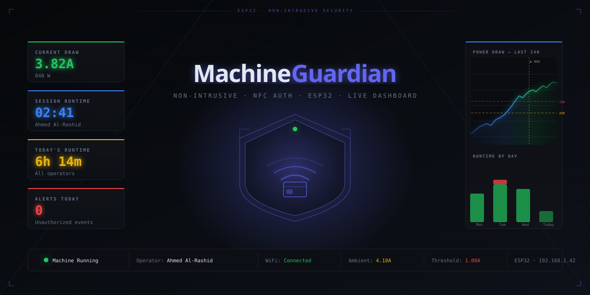

# Machine Guardian

> Non-intrusive machine access control and energy monitoring for workshops and labs.
> Built entirely on an ESP32 — no cloud required.



## What it does

Machine Guardian clamps onto the power line of any machine and watches for current draw. Employees authenticate with an NFC card before starting the machine. If the machine is started without a valid card, the system triggers an alarm, flashes the red LED, sounds the buzzer, and sends a Telegram alert — all without cutting power or touching the machine's wiring.

A built-in web dashboard (served directly from the ESP32) shows live current draw, session history, employee usage, and unauthorized access events. All data can be downloaded as a multi-sheet Excel file.


---

## Feature overview

| Feature | Detail |
|---|---|
| **Non-intrusive sensing** | SCT-013 current clamp — no wiring modifications |
| **NFC authentication** | PN532 module, MIFARE ISO14443A cards/fobs |
| **Ambient cancellation** | Subtracts room noise baseline so low-power machines are detectable |
| **Live web dashboard** | Served from ESP32 PROGMEM, no SD card or external server |
| **Real-time chart** | Current draw chart updates every 2 seconds with ambient/threshold lines |
| **Demo data** | Chart pre-fills with 3 days of historical demo data on first boot |
| **Employee management** | Add/remove/deactivate employees via the website, stored in NVS flash |
| **Unauthorized tracking** | Tracks runtime and power usage of unauth machine starts separately |
| **Telegram alerts** | HTTPS POST directly from ESP32 on unauthorized access |
| **Excel export** | Download full dataset (power log, runtime, operator summary, event log) |
| **Persistent config** | Ambient baseline, threshold, and employees survive reboots via NVS |
| **Threshold control** | Set detection threshold from the Settings page, no reflashing needed |

---

## Hardware required

| Component | Notes |
|---|---|
| ESP32 DevKit (38-pin) | Any ESP32 with ADC on pin 34 |
| SCT-013 current clamp (100A/50mA) | Bare CT output — **not** the -030 voltage variant |
| PN532 NFC/RFID module V3 | Set DIP switches to I2C mode: 1=ON, 2=OFF |
| SSD1306 OLED 0.91" I2C | Address 0x3C |
| Red, Green, Yellow LEDs | 5mm, any colour |
| Active buzzer | 3.3V compatible |
| Resistors | 3× 220Ω (LEDs), 2× 10kΩ (bias divider), 1× 33Ω 1% metal film (burden) |
| Capacitors *(optional)* | 10µF electrolytic (bias filter), 100nF ceramic × 3 (decoupling) — recommended for PCB builds |

**NFC cards/fobs:** any MIFARE Classic or MIFARE Ultralight card works. The system reads the UID only.

---

## Wiring

### Pin assignments

| Signal | ESP32 Pin |
|---|---|
| SCT-013 ADC input | 34 |
| I2C SDA (PN532 + OLED) | 21 |
| I2C SCL (PN532 + OLED) | 22 |
| Green LED | 18 |
| Red LED | 19 |
| Yellow LED | 5 |
| Buzzer | 23 |

### SCT-013 bias and burden circuit

The SCT-013 100A/50mA is a bare current-transformer (CT) that outputs current proportional to the line current. It needs two external circuits:

**Burden resistor** — converts CT current output to a voltage the ADC can read.
- Solder a **33Ω 1% metal film** resistor directly across OUT+ and OUT-.
- At 100A primary, the CT outputs 50mA × 33Ω = **1.65V peak** — within the 3.3V ADC range.

**Bias voltage divider** — shifts the AC signal up so it stays positive (ADC only reads 0–3.3V).
- 3.3V → 10kΩ → **node** → 10kΩ → GND
- Connect the **node** to OUT+ and to ESP32 pin 34.
- Add a **10µF** capacitor between the node and GND to stabilise the DC midpoint.

```
3.3V ─── 10kΩ ─── NODE ─── 10kΩ ─── GND
                    │  │
                   34  33Ω (burden across CT terminals)
                        │
                       GND
```

### PN532 I2C mode

Set the two DIP switches on the PN532 module: **switch 1 = ON, switch 2 = OFF**.  
The module shares the I2C bus with the OLED (SDA → pin 21, SCL → pin 22).

### LED wiring

Each LED: `ESP32 pin → 220Ω resistor → LED anode → LED cathode → GND`

### Buzzer

Active buzzer: `+` to pin 23, `–` to GND. If your buzzer draws more than 40mA, add an NPN transistor driver (2N2222): base via 1kΩ from pin 23, collector to buzzer+/3.3V, emitter to GND.

---

## PCB soldering guide

When soldering the final board, the layout choices below eliminate the PN532 interference that plagues breadboard builds.

### Component placement zones

```
┌─────────────────────────────────────────────────┐
│  [CT Circuit]          │          [OLED]        │
│  Top-left corner       │       Top-right        │
│  Burden + bias divider │                        │
│  ADC trace ≤3cm        │                        │
│                        │                        │
│         [ESP32 — centre of board]               │
│                                                 │
│  [LEDs + Buzzer]       │       [PN532]          │
│  Bottom-left           │   Bottom-right corner  │
│                        │   As far from CT as    │
│                        │   possible             │
└─────────────────────────────────────────────────┘
```

### Critical rules

1. **Ground plane** — pour copper fill on the bottom layer. Connect every GND pad to the plane via vias. This single change eliminates the majority of ADC noise.

2. **Star ground** — all GND traces meet at one point (the ESP32 GND pin), not daisy-chained.

3. **Decoupling capacitors** *(optional but recommended)* — place within 2mm of each VCC pin if you have them:
   - PN532: 100nF ceramic + 10µF electrolytic
   - OLED: 100nF ceramic
   - ESP32 3.3V pin: 100nF ceramic
   
   The firmware's `Wire.end()` trick handles most interference without caps. They improve ADC stability on a soldered PCB but are not required for the system to work.

4. **I2C pull-ups** — 4.7kΩ from SDA to 3.3V, 4.7kΩ from SCL to 3.3V. Check if your PN532 module already has them before adding more.

5. **ADC trace isolation** — route the ADC trace (node → pin 34) away from I2C traces. If they must cross, do so at 90°.

6. **CT cable** — twisted pair, ≤15cm. If using shielded cable, connect the shield to GND at the PCB end only (not both ends — that creates a ground loop).

---

## Software setup

### Prerequisites

- [PlatformIO](https://platformio.org/) (VS Code extension or CLI)
- ESP32 Arduino core (installed automatically by PlatformIO)

### Installation

```bash
git clone https://github.com/YOUR_USERNAME/machine-guardian.git
cd machine-guardian
```

Open `src/main.cpp` and fill in your credentials (the only lines you need to edit):

```cpp
// Wi-Fi
const char* WIFI_SSID     = "YOUR_WIFI_SSID";
const char* WIFI_PASSWORD = "YOUR_WIFI_PASSWORD";

// Telegram — leave both blank ("") to disable alerts
const char* TELEGRAM_TOKEN   = "";   // from @BotFather
const char* TELEGRAM_CHAT_ID = "";   // your personal or group chat ID
```

Then flash:

```bash
pio run --target upload
pio device monitor   # watch boot log and see your device's IP
```

---

## Telegram bot setup

1. Open Telegram and message **@BotFather** → `/newbot` → follow prompts → copy the **token**.
2. Send any message to your new bot (this starts the chat).
3. Open this URL in a browser (replace `<TOKEN>` with yours):
   ```
   https://api.telegram.org/bot<TOKEN>/getUpdates
   ```
4. Find `"chat":{"id": 123456789}` in the response — that number is your **chat ID**.
5. Paste both values into `main.cpp` and reflash.

All Telegram calls run entirely on the ESP32 over HTTPS. No external server or intermediary is needed.

---

## First-time calibration

After flashing and connecting to WiFi, open the dashboard at `http://<ESP32-IP>` in any browser. The IP is printed in the serial monitor at boot and shown on the OLED.

### 1. Capture ambient baseline (required)

The current clamp picks up ~4A of room noise from nearby mains wiring. The ambient capture removes this.

1. Make sure the machine you are monitoring is **completely off**.
2. Go to **Settings → Ambient Calibration → Capture Ambient**.
3. Wait ~3 seconds. The device takes 30 samples, averages them, adds a 10% safety margin, and saves the result to flash.

You only need to redo this if you move the device to a different location.

### 2. Set detection threshold (optional)

The default threshold is **1.0A net** (above ambient). This works for most machines.

- Go to **Settings → Detection Threshold**.
- If you get false triggers (machine detected when off), increase the threshold.
- If your machine isn't being detected, decrease it.
- Changes are saved to flash immediately.

### 3. Add employees

1. Have each employee scan their card on the NFC reader.
2. The UID appears in the Event Log as `Unknown card: XXXXXXXX`.
3. Go to **Employees → Add New Employee**, click "Use this UID", enter their name, click "Add & Save".

Employee records are stored in NVS flash and survive all reboots and firmware updates.

---

## Web dashboard

Open `http://<ESP32-IP>` from any device on the same WiFi network.

### Dashboard page

| Element | Description |
|---|---|
| Machine banner | Current state: Idle / Authenticated / Running / Unauthorized |
| Live current gauge | Raw amps with visual markers for ambient level and detection threshold |
| Net current | Raw minus ambient — what the detection logic uses |
| Power chart | Current draw over time with dashed lines for ambient and threshold. Demo data fills the past 3 days; real data appears at a "▶ NOW" divider |
| Runtime chart | Authorised (green) vs unauthorised (red) machine time per day |
| Usage pie | Per-employee runtime breakdown (real data only) |
| Event log | Every state change, NFC scan, and alert with timestamps |

### Employees page

- View all registered employees and their total runtime.
- Unauthorised usage appears as a red row at the bottom.
- Add new employees from UID scans or manual entry.
- Deactivate employees (blocks their card without deleting the record).

### Settings page

- **Detection threshold** — change without reflashing.
- **Ambient calibration** — recapture the noise baseline.
- **Download Excel** — exports Power Log, Runtime by Day, Operator Summary, and Event Log as a `.xlsx` file. Demo data is excluded from all sheets.
- **Device info** — live ADC readings for debugging.

---

## System behaviour

### State machine

```
         ┌──────────────────────────────────────────────────┐
         │                                                  │
    ┌────▼────┐   Valid NFC scan   ┌───────────────┐        │
    │  IDLE   ├───────────────────►│ AUTHENTICATED │        │
    │ Red LED │                    │  Yellow LED   │        │
    └────┬────┘                    └──────┬────────┘        │
         │                               │                  │
         │ Machine ON                    │ Machine ON       │
         │ (no auth)                     │ (within 30s)     │
         │                               │                  │
    ┌────▼──────────┐            ┌───────▼────────┐         │
    │ UNAUTHORIZED  │            │    RUNNING     │         │
    │ Red flash     │            │   Green LED    ├─────────┘
    │ Buzzer alarm  │            │ Tracks runtime │ Machine OFF
    │ Telegram alert│            └────────────────┘
    └───────────────┘
         │ (auto-returns to IDLE after alarm)
```

- **Auth timeout:** if a valid card is scanned but the machine is not started within 30 seconds, the system returns to IDLE.
- **Unauthorized tracking:** the duration between an unauthorized start and the machine turning off is logged under `UNAUTHORIZED` in the runtime charts.
- **Unknown card:** scanning an unregistered card logs a warning and shows the UID on the OLED and in the Event Log, but does not trigger the alarm.

### Current measurement

The firmware pauses the I2C bus while taking ADC samples (`Wire.end()` / `Wire.begin()`). This eliminates the PN532's switching noise from coupling into the ADC — reducing the ambient from ~4–8A down to ~0.7A on a breadboard. On a properly decoupled PCB this step is harmless and can be left in.

Measurement formula:
```
rmsVolts = sqrt(mean(samples²)) × (3.3V / 4095)
rawAmps  = (rmsVolts / BURDEN_OHM) × TURNS_RATIO
netAmps  = max(rawAmps − gAmbientAmps, 0)
filtered = 0.15 × netAmps + 0.85 × filtered   ← exponential moving average
```

---

## API reference

The ESP32 exposes a simple REST API used by the dashboard. All endpoints return JSON.

| Method | Endpoint | Description |
|---|---|---|
| GET | `/` | Dashboard HTML |
| GET | `/api/status` | Live sensor state, amps, employee, session runtime |
| GET | `/api/power` | Power log (last 24h, 5s interval, machine-on sessions only) |
| GET | `/api/runtime` | Runtime entries by date and employee |
| GET | `/api/notifications` | Event log (last 50 events) |
| GET | `/api/set_ambient` | Capture and save ambient baseline |
| GET | `/api/employees` | Employee list (name + active status, **no UIDs**) |
| POST | `/api/employees/add` | `{"name":"...","uid":"..."}` |
| POST | `/api/employees/remove` | `{"index": N}` |
| POST | `/api/employees/toggle` | `{"index": N}` — activate/deactivate |
| POST | `/api/employees/clear` | Delete all employees |
| POST | `/api/set_threshold` | `{"threshold": 1.5}` — net amps |

---

## NVS storage layout

Employee records and calibration values are stored in the `guardian` NVS namespace.

| Key | Type | Value |
|---|---|---|
| `emp_count` | int | Number of registered employees |
| `emp_uid_N` | string | Card UID for employee N |
| `emp_name_N` | string | Name for employee N |
| `emp_act_N` | uint8 | 1 = active, 0 = deactivated |
| `ambient` | float | Ambient baseline in amps |
| `threshold` | float | Detection threshold in net amps |

NVS survives normal firmware flashes. To fully reset, use `pio run -t erase` (erases the entire flash including NVS).

---

## Troubleshooting

### Ambient reads 4–8A with machine off

The PN532 is coupling noise into the ADC via shared power rails. The firmware already calls `Wire.end()` before sampling to mitigate this. If it persists:
- Verify I2C and ADC traces don't run parallel on the PCB.
- Add 100nF + 10µF decoupling caps to the PN532 VCC pin.
- Recapture ambient from the Settings page after the PCB is soldered.

### ESP32 resets when scanning unknown NFC card

Fixed in the current firmware. The crash was a `LoadProhibited` fault from `uidLen = 0` being passed to the UID string builder. The fix guards `uidLen` before any byte access.

### Machine not detected / threshold too high

1. Go to **Settings → Ambient Calibration** and recapture with the machine off.
2. Go to **Settings → Detection Threshold** and lower it. A monitor typically draws 1.5–3A net above ambient.

### OLED not found

Verify the I2C address. Most SSD1306 0.91" modules are `0x3C`. Change `OLED_ADDR` in the firmware if yours is `0x3D`.

### PN532 not found at boot

Verify DIP switch position: switch 1 = ON (towards the dot), switch 2 = OFF. I2C mode is the only one supported by this firmware.

### WiFi not connecting

The firmware tries for 15 seconds then boots in offline mode. The dashboard is still served; only Telegram alerts and NTP time sync require WiFi.

---

## Configuration reference

All tuneable constants are near the top of `src/main.cpp`:

```cpp
// Sensor — match to your specific CT model
const float BURDEN_OHM  = 33.0f;    // burden resistor value in ohms
const float TURNS_RATIO = 2000.0f;  // CT primary/secondary ratio (100A / 0.05A)

// EMA filter — higher alpha = faster response but more noise
const float LP_ALPHA = 0.15f;

// Auth timeout — seconds before authenticated state reverts to idle
const unsigned long AUTH_TIMEOUT_MS = 30000;

// Power log interval — how often to store a sample during a running session
const unsigned long POWER_SAMPLE_INTERVAL = 5000;  // ms

// OLED I2C address — 0x3C on most modules, 0x3D on some
#define OLED_ADDR 0x3C

// Timezone offset for NTP — 3*3600 = UTC+3 (Saudi Arabia)
configTime(3 * 3600, 0, "pool.ntp.org");
```

Threshold and ambient are runtime-configurable from the Settings page and do not require reflashing.

---

## Project structure

```
machine-guardian/
├── src/
│   └── main.cpp          # Full firmware — ESP32 C++ with embedded HTML dashboard
├── docs/
│   ├── wiring.md         # Detailed wiring tables and PCB layout notes
│   └── api.md            # Full API documentation with example responses
├── hardware/
│   └── bom.md            # Bill of materials with part numbers
├── platformio.ini         # PlatformIO build config and library dependencies
├── .gitignore
├── LICENSE
└── README.md
```

